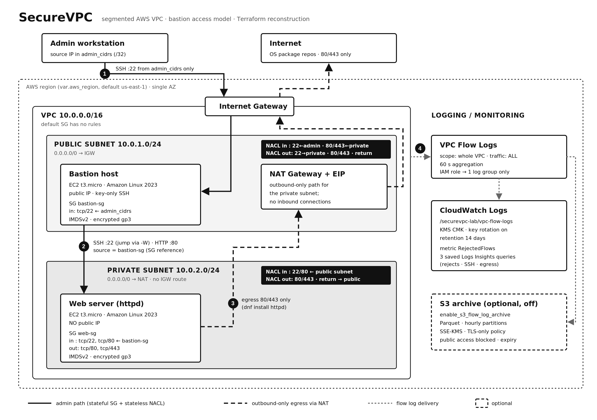

# SecureVPC

A segmented AWS network written in Terraform. A bastion host sits in a public subnet. A web server
sits in a private subnet with no public IP. It can only be reached through the bastion, and it
reaches the internet outbound only, through a NAT Gateway. Security groups, network ACLs and VPC
Flow Logs to CloudWatch control and record traffic between the tiers.



> **Provenance.** I first built SecureVPC by hand in the AWS console in August 2025. That build is
> the first commit of this repository, and its notes and screenshots are kept unchanged in
> [`original-2025/`](original-2025/), with the account ID and a home IP redacted. After I lost the local working files, I rebuilt the same
> architecture as Terraform in October 2026. Everything outside `original-2025/` belongs to that
> reconstruction and was committed in 2026. No history was rewritten or backdated.
> [Reconstruction notes](#reconstruction-notes) lists what was kept and what changed.

> **Advanced profile (2026 extension).** [`terraform/advanced/`](terraform/advanced/) is a
> separate, clearly new design built on the same idea: 2 AZs and five subnet tiers, AWS Network
> Firewall, WAF on an ALB, Route 53 DNS Firewall, VPC endpoints, SSM Session Manager instead of
> SSH, flow logs to Athena, and CloudWatch alarms → SNS. It was **not** part of the 2025 build.
> See [`docs/advanced.md`](docs/advanced.md).

**Status:** the Terraform passes `fmt`, `validate`, mocked `terraform test`, TFLint and Checkov in CI.
The reconstruction **has not been applied to a live AWS account yet**. The only screenshots of
deployed resources are the 2025 console ones.

---

## Contents

- [Problem](#problem)
- [Architecture](#architecture)
- [Network segmentation](#network-segmentation)
- [Access model](#access-model)
- [Security controls](#security-controls)
- [Logging and monitoring](#logging-and-monitoring)
- [Repository layout](#repository-layout)
- [Deployment](#deployment)
- [Validating a deployment](#validating-a-deployment)
- [Teardown](#teardown)
- [Cost awareness](#cost-awareness)
- [Technical decisions](#technical-decisions)
- [Reconstruction notes](#reconstruction-notes)
- [Development environment](#development-environment)
- [Static checks / CI](#static-checks--ci)
- [Advanced profile](#advanced-profile)

## Problem

Putting a workload on a public subnet with a public IP gives it the whole internet as attack
surface. The usual alternative is to put it in a private subnet and allow only these paths:

- One controlled path **in** for administrators, through a bastion that accepts SSH only from known
  source addresses.
- One path **out** for patches and packages, through NAT, with no way for the internet to start a
  connection.
- A record of traffic that was accepted and rejected, so the controls can be checked.

SecureVPC builds the smallest version of that pattern that still works end to end.

## Architecture

| Component | Placement | Purpose |
|---|---|---|
| VPC `10.0.0.0/16` | region `var.aws_region` (default `us-east-1`) | Network boundary; DNS support/hostnames on |
| Internet Gateway | VPC | Internet route for the public subnet only |
| Public subnet `10.0.1.0/24` | one AZ | Bastion host and NAT Gateway |
| Private subnet `10.0.2.0/24` | same AZ | Web server; no route to the IGW |
| NAT Gateway + Elastic IP | public subnet | Outbound-only internet access for the private subnet |
| Bastion host | public subnet, public IP | The only SSH entry point |
| Web server (Apache httpd) | private subnet, **no public IP** | The protected workload |
| Security groups | per instance | Main, stateful access control |
| Network ACLs | per subnet | Second, stateless subnet-level filter |
| VPC Flow Logs | whole VPC, `ALL` traffic | Record of accepted and rejected traffic |
| CloudWatch Logs | log group `/<name>/vpc-flow-logs` | Searchable flow logs, metric, saved queries |
| S3 archive (optional, off by default) | bucket | Long-term Parquet copy of flow logs |

The diagram source is [`docs/architecture.svg`](docs/architecture.svg). The numbered paths are:
(1) admin SSH to the bastion, (2) bastion to web server, (3) web server egress through NAT, and
(4) flow log delivery.

## Network segmentation

| Route table | Destination | Target |
|---|---|---|
| public | `10.0.0.0/16` | local |
| public | `0.0.0.0/0` | Internet Gateway |
| private | `10.0.0.0/16` | local |
| private | `0.0.0.0/0` | NAT Gateway |

The private subnet has no route to the Internet Gateway, and the web server has no public IP.
Nothing on the internet can address it. NAT translates only connections that start inside the VPC.

Both subnets set `map_public_ip_on_launch = false`. The bastion gets its public IP explicitly on
the instance resource, so nothing launched into either subnet later gets one by accident.

## Access model

```
admin workstation ──SSH:22──▶ bastion (public)  ──SSH:22 / HTTP:80──▶ web server (private)
   (admin_cidrs)                 bastion-sg                              web-sg ← bastion-sg only
```

- **Who can reach the bastion:** only source ranges in `admin_cidrs`, on TCP 22, with key
  authentication. The variable is required and has no default. Its validation rejects `0.0.0.0/0`
  and anything broader than a `/16`.
- **Who can reach the web server:** only instances in `bastion-sg`, on TCP 22 and 80. The
  security group rule references the bastion's **security group**, not a CIDR. Other hosts in the
  public subnet don't get access just by having an IP in that range.
- **How the admin gets to the web server:** the SSH connection is tunnelled through the bastion
  (`ProxyCommand ssh -W`), so **the private key stays on the workstation**. The 2025 build copied
  the `.pem` file onto the bastion. That is the main change to the access model.
- **What the web server can reach:** TCP 80/443 outbound only, through NAT, for OS packages.

## Security controls

All of these are in code and checked by the tests in
[`terraform/tests/securevpc.tftest.hcl`](terraform/tests/securevpc.tftest.hcl) and/or Checkov.

**Network**
- Default VPC security group has no rules (`aws_default_security_group`), so resources that fall
  back to it get no access.
- `bastion-sg`: in TCP 22 from `admin_cidrs`. Out: TCP 22/80 to `web-sg` only, plus TCP 443 for
  package updates.
- `web-sg`: in TCP 22/80 from `bastion-sg` only. Out: TCP 80/443 (packages through NAT).
- Custom NACL per subnet, written as explicit numbered rules
  ([`modules/network/nacls.tf`](terraform/modules/network/nacls.tf)). The private NACL allows
  SSH/HTTP only from the public subnet CIDR.

**Instances**
- IMDSv2 required (`http_tokens = "required"`, hop limit 1).
- Encrypted gp3 root volumes, deleted with the instance.
- No IAM instance profile on either instance. Neither instance has AWS API credentials.
- `sshd` drop-in on both hosts: no password or keyboard-interactive auth, no root login, no agent
  or X11 forwarding, `MaxAuthTries 3`. TCP forwarding is allowed on the bastion only, for the jump.
- Amazon Linux 2023 AMI resolved at plan time from the public SSM parameter, so it is current and
  not a hardcoded AMI ID.

**Secrets and identity**
- No credentials anywhere in the repo. The provider uses the standard AWS credential chain
  (profile, SSO or environment).
- Terraform only receives the SSH **public** key. Validation rejects anything that looks like a
  private key.
- `*.tfvars`, state, plans and key files are git-ignored. Only `terraform.tfvars.example` is
  committed.
- The Flow Logs IAM role trusts only `vpc-flow-logs.amazonaws.com`, with `aws:SourceAccount` and
  `aws:SourceArn` conditions. It can write only to its own log group. The 2025 policy used
  `Resource: "*"`.

**Logs at rest**
- CloudWatch log group encrypted with a customer-managed KMS key with rotation enabled. This is on
  by default and can be turned off with `enable_kms_encryption = false`.
- Optional S3 archive: Block Public Access on, bucket-owner-enforced ownership, versioning, SSE-KMS,
  a lifecycle expiry, and a bucket policy that denies non-TLS requests.

## Logging and monitoring

- **VPC Flow Logs** for the whole VPC, traffic type `ALL`, 60-second aggregation, delivered to
  CloudWatch Logs with 14-day retention (all configurable).
- **Metric filter** `RejectedFlows` (namespace `SecureVPC/<name>`) counts `REJECT` records. You can attach an alarm to it.
- **Saved Logs Insights queries**, under *CloudWatch → Logs Insights → Saved queries*:
  - `<name>/top-rejected-sources`: who is being blocked, and on which ports
  - `<name>/ssh-attempts`: every TCP 22 flow, accepted and rejected
  - `<name>/accepted-flows-by-destination-port`: what traffic is actually allowed
- **Optional S3 archive** (`enable_s3_flow_log_archive = true`): a second flow log to S3 in Parquet
  with hourly partitions, for longer retention or Athena. It is off by default because the 2025
  build used CloudWatch only and the lab doesn't need two copies.

## Repository layout

```
.
├── terraform/
│   ├── main.tf, variables.tf, outputs.tf, providers.tf, versions.tf
│   ├── terraform.tfvars.example     # copy to terraform.tfvars (git-ignored)
│   ├── backend.tf.example           # optional S3 remote state
│   ├── modules/
│   │   ├── network/    # VPC, subnets, IGW, NAT, routes, NACLs, default SG
│   │   ├── security/   # bastion-sg, web-sg and their rules
│   │   ├── compute/    # key pair, bastion, web server, user-data templates
│   │   ├── flow_logs/  # Flow Logs, CloudWatch, IAM, KMS, optional S3
│   │   └── tiered_network/ network_firewall/ tier_security/ vpc_endpoints/
│   │       dns_firewall/ web_tier/ flow_log_analytics/   # used by advanced/ only
│   ├── tests/securevpc.tftest.hcl   # offline tests with a mocked AWS provider
│   └── advanced/                    # 2026 advanced profile (root module + tests)
├── scripts/
│   ├── bootstrap.sh    # pinned, checksum-verified dev tools
│   ├── check.sh        # fmt, validate, test, tflint, checkov, shellcheck
│   ├── verify.sh       # read-only checks of a live deployment
│   ├── cost-check.sh   # confirm nothing billable is left after destroy
│   ├── verify-advanced.sh  # read-only checks of a live advanced deployment
│   └── reachability.sh     # Reachability Analyzer paths for the advanced profile
├── docs/architecture.svg / .png, architecture-advanced.svg / .png, advanced.md
├── original-2025/      # unchanged notes + screenshots from the console build
└── Makefile
```

## Deployment

**Prerequisites**
- Terraform ≥ 1.7 (CI uses 1.9.8; `make bootstrap` installs it)
- AWS CLI v2 with credentials for a **non-production** account. The identity needs permission to
  manage VPC, EC2, IAM roles, CloudWatch Logs and KMS, and S3/Budgets if you enable those.
- An SSH key pair. Only the public half is used:
  `ssh-keygen -t ed25519 -f ~/.ssh/securevpc -C securevpc`
- `jq` (used by `scripts/verify.sh`)

**Steps**

```bash
cd terraform
cp terraform.tfvars.example terraform.tfvars
# edit: admin_cidrs = ["$(curl -s https://checkip.amazonaws.com)/32"], ssh_public_key = "<contents of ~/.ssh/securevpc.pub>"

cd ..
make init
make plan          # read the plan before applying
make apply
make output
```

The web server installs httpd during first boot, through the NAT Gateway. Allow a minute or two
after `apply` before testing HTTP.

**Inputs you will usually set:** `admin_cidrs`, `ssh_public_key`, `aws_region`,
`budget_alert_email`. Every variable is documented with validation in
[`terraform/variables.tf`](terraform/variables.tf).

## Validating a deployment

`terraform output` prints ready-made commands, including `ssh_bastion_command`,
`ssh_web_via_bastion_command`, `curl_web_via_bastion_command`, `check_nat_egress_command` and
`tail_flow_logs_command`. The checks, mirroring the 2025 tests:

| # | Check | Command | Expected |
|---|---|---|---|
| 1 | Bastion reachable from admin IP | `$(terraform -chdir=terraform output -raw ssh_bastion_command)` | shell on bastion |
| 2 | Web server via bastion only | `$(terraform -chdir=terraform output -raw ssh_web_via_bastion_command)` | shell on web server |
| 3 | HTTP from bastion | `$(terraform -chdir=terraform output -raw curl_web_via_bastion_command)` | `<h1>Secure Web Server</h1>` followed by `<!-- <name> -->` |
| 4 | No direct path from outside | `curl -m 5 http://<web_private_ip>` from your workstation | times out |
| 5 | Web server has no public IP | `terraform -chdir=terraform output web_public_ip` | `""` |
| 6 | Egress goes through NAT | `$(terraform -chdir=terraform output -raw check_nat_egress_command)` | equals `nat_public_ip` |
| 7 | Flow logs arriving | `$(terraform -chdir=terraform output -raw tail_flow_logs_command)` | ACCEPT/REJECT records |

`make verify` (`scripts/verify.sh`) runs the infrastructure-side checks with **read-only** AWS CLI
calls. It covers routes, NAT state, public-IP absence, SG and NACL rules, flow log status and
recent REJECT records. It prints `PASS`/`FAIL` per check and **masks the 12-digit account ID**,
so its output can go in a screenshot or README.

Before sharing any screenshot, redact the account ID, public IPs, and anything from `aws sts
get-caller-identity` or `aws configure`. Never paste credential files or `terraform.tfstate`. State
contains resource IDs and the public key.

## Teardown

```bash
make destroy                    # terraform destroy; type "yes" to confirm
make cost-check REGION=us-east-1
```

`cost-check.sh` lists any remaining resources tagged `Project=SecureVPC`: instances, NAT Gateways,
Elastic IPs, VPCs, log groups and S3 buckets. It should print nothing under each heading. Notes:

- A NAT Gateway takes a few minutes to delete. `destroy` waits for it.
- With KMS enabled, the key enters a **7-day pending-deletion** window and isn't billed during it.
- With the S3 archive enabled, `destroy` empties and deletes the bucket by default
  (`s3_archive_force_destroy = true`), so the lab tears down completely. To keep archived logs, set
  it to `false`. `destroy` then stops at the non-empty bucket, and `cost-check.sh` keeps listing it
  until you remove it.

## Cost awareness

This is **not free tier**. The NAT Gateway is billed per hour from creation to deletion, plus per
GB processed, whether or not traffic flows, and it is the largest line item. Public IPv4 addresses
(bastion and NAT EIP) are also billed hourly. Smaller costs are two `t3.micro` instances, 2 × 8 GB
gp3, CloudWatch Logs ingestion and storage, and the KMS key (monthly per key). Check current
prices for your region at <https://aws.amazon.com/pricing/>. No cost figures are claimed here.

Guardrails in this repo:
- Set `budget_alert_email` to create an AWS Budget that emails at 80 % of actual and 100 % of
  forecast spend (`monthly_budget_usd`, default 20).
- Short log retention (14 days) and S3 lifecycle expiry (30 days) by default.
- Detailed EC2 monitoring is off, and the S3 archive is off.
- Every resource is tagged `Project=SecureVPC`, `ManagedBy=Terraform`, so it is easy to find in
  Cost Explorer and with `cost-check.sh`.
- **Run `make destroy` when you finish a session.** The lab is meant to be created and destroyed,
  not left running.

## Technical decisions

- **Terraform with small local modules** (`network`, `security`, `compute`, `flow_logs`). The 2025
  build was manual console clicks, which nobody can review or repeat. Modules map to the security
  layers, so each one can be reviewed on its own.
- **Security groups do the access control; NACLs are a second check.** NACLs are stateless and
  CIDR-based, so they can't express "only the bastion". The SG reference does that. The NACLs
  restrict which subnet may talk to which on which ports, and leave return-path ephemeral ports open.
- **Private NACL allows inbound ephemeral ports from `0.0.0.0/0`.** Replies to the web server's
  NAT'd requests arrive with the **internet server's** source address, not the NAT's. The 2025 rule
  (ephemeral from `10.0.1.0/24` only) would drop those replies.
- **SSH tunnelled through the bastion instead of copying the key onto it**, so the bastion never
  holds credentials for the private tier.
- **Single AZ, single NAT**, as in the original. That is enough to show segmentation at the lowest
  cost. A production version would use one NAT Gateway per AZ and subnets in at least two AZs.
- **Bastion over SSM Session Manager.** Session Manager would remove inbound SSH completely and is
  the better production choice. The bastion is kept because the project exists to show a bastion
  access model, as in the original.
- **Local state by default.** It is a single-operator lab. `backend.tf.example` shows S3 remote
  state with encryption and locking if needed.
- **CloudWatch as the primary flow log destination, S3 optional.** This matches the original, and
  CloudWatch gives immediate querying. S3 is there for retention or Athena, not as a requirement.

## Reconstruction notes

What came from the 2025 build ([`original-2025/readme.md.txt`](original-2025/readme.md.txt) and the
screenshots), and what the reconstruction changes:

| Aspect | 2025 console build | 2026 Terraform reconstruction |
|---|---|---|
| Provisioning | Manual, AWS console | Terraform modules, CI-checked |
| VPC / subnets | 10.0.0.0/16, 10.0.1.0/24, 10.0.2.0/24 | Same (variables) |
| IGW, NAT, routes | Public → IGW, private → NAT | Same |
| Bastion SG | 22 from my IP; egress all | 22 from `admin_cidrs`; egress 22/80 → web-sg, 443 |
| Web SG | 22, 80 from BastionSG; egress all | Same ingress; egress 80/443 only |
| NACLs | Custom, per subnet | Custom, per subnet, with NAT return path fixed |
| Instances | t2.micro, key copied to bastion | t3.micro, IMDSv2, encrypted gp3, key stays local |
| Web page | httpd, `<h1>Secure Web Server</h1>` | Same |
| Flow Logs | ALL → CloudWatch, 10-min aggregation | ALL → CloudWatch, 60 s, KMS, retention, metric, saved queries |
| Flow Logs IAM | `Resource: "*"` | Scoped to one log group, confused-deputy conditions |
| S3 | Not used | Optional archive, off by default |
| Cost controls | None | Budget alert, tags, teardown + cost-check script |

## Development environment

```bash
make bootstrap                                  # scripts/bootstrap.sh
terraform -chdir=terraform init -backend=false
make check
```

`scripts/bootstrap.sh` installs the CI tool versions into `~/.local/bin`. It is idempotent, so it
skips tools that are already present.

| Tool | Version | How it's verified |
|---|---|---|
| Terraform | 1.9.8 | release zip, pinned SHA-256 |
| TFLint | 0.53.0 | release zip, pinned SHA-256 |
| tflint-ruleset-aws | 0.34.0 | release zip, pinned SHA-256, installed into `~/.tflint.d/plugins` so `tflint --init` doesn't need the GitHub API |
| Checkov | 3.3.23 | pinned version, `pip install --user` |
| ShellCheck | 0.11.0 (`shellcheck-py` 0.11.0.1) | pinned version, `pip install --user` |

Checksums are hardcoded in the script, copied from each project's published `SHA256SUMS` /
`checksums.txt`. A download that doesn't match aborts the install. The script pins `linux_amd64`
only. Add `~/.local/bin` to `PATH` if it isn't already there.

## Static checks / CI

```bash
make check     # no AWS credentials needed
```

runs `terraform fmt -check`, then `terraform validate` and `terraform test` for both root modules
(`terraform/` and `terraform/advanced/`), then TFLint with the AWS ruleset,
Checkov and ShellCheck. GitHub Actions runs the same on every push and PR
([`.github/workflows/terraform.yml`](.github/workflows/terraform.yml)). `terraform test` runs
offline with a mocked AWS provider and mocked resource ARNs.

The `terraform test` suite plans and applies the stack against a mocked provider. It asserts the
segmentation (routes, NAT placement, no public IP on the web server), the SG-to-SG reference, the
NACL source restrictions, the instance hardening, the flow log configuration, and that unsafe
inputs (`0.0.0.0/0`, wide CIDRs, private-key material) are rejected.

Checkov skips are inline with a reason next to each one, for example SG-reference rules that
Checkov reads as open ingress, and attachments that happen in another module.

## Advanced profile

[`terraform/advanced/`](terraform/advanced/) is a separate root module, added in 2026, that takes
the same segmentation idea further. The 2025 build had none of it, and it **has not been deployed**.


- **Five tiers in 2 AZs:** firewall, public (ALB, optional NAT), app, endpoints, and data (no route
  out of the VPC).
- **No SSH at all:** SSM Session Manager over interface endpoints, KMS-encrypted and logged.
- **AWS Network Firewall** with IGW edge routing and symmetric same-AZ routes. Strict order,
  AWS-managed threat groups, default drop. Egress is off unless you allowlist domains.
- **AWS WAF on an ALB** (managed rule groups + rate limit) in front of a private Auto Scaling group.
- **Route 53 Resolver DNS Firewall:** threat lists blocked, walled garden, fail closed, queries logged.
- **VPC endpoints with endpoint policies** for SSM, Logs, KMS and S3.
- **Detection:** flow logs v5 → S3 Parquet → Athena, plus five CloudWatch alarms → SNS.
- **Validation:** 18 offline `terraform test` runs, `make adv-verify`, and Reachability Analyzer
  paths (`make reachability`).

It costs roughly USD 23/day with the defaults, mainly Network Firewall. Full details, deployment,
cost table and teardown are in [`docs/advanced.md`](docs/advanced.md).
