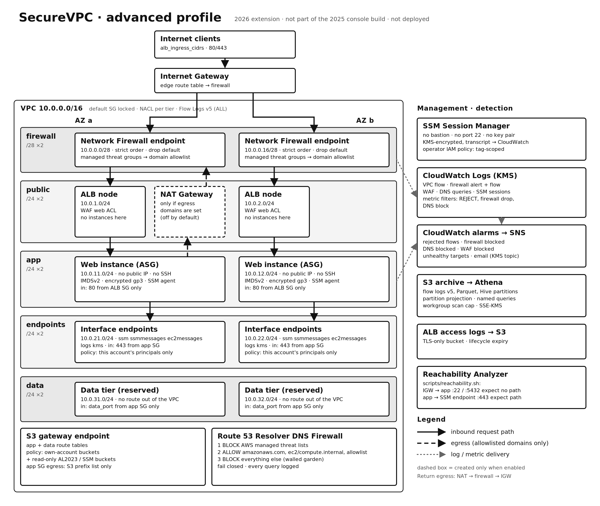

# SecureVPC advanced profile (2026 extension)

> **Provenance.** This profile is new design work from October 2026. It was **not** part of the
> 2025 console build. The faithful reconstruction of that build is still in [`terraform/`](../terraform/).
> This profile lives in [`terraform/advanced/`](../terraform/advanced/).
> **It has not been deployed to AWS.** It passes `fmt`, `validate`, 18 offline `terraform test`
> runs against a mocked provider, TFLint and Checkov. Nothing here has been run against real AWS.



## What changes compared with the original

| Concern | Original profile (`terraform/`) | Advanced profile (`terraform/advanced/`) |
|---|---|---|
| AZs | 1 | 2 (or 3) |
| Subnet tiers | public, private | firewall, public, app, endpoints, data |
| Admin access | SSH through a bastion | SSM Session Manager over VPC endpoints. No bastion, no port 22, no key pair |
| Web entry | none from the internet (curl via bastion) | ALB in the public tier with AWS WAF. Instances stay private |
| Inspection | SG + NACL | SG + NACL + AWS Network Firewall (stateful, strict order, default drop) |
| Egress | anything on 80/443 through NAT | **off by default**. Optional domain allowlist enforced by Network Firewall (TLS SNI / HTTP Host) |
| AWS API traffic | through NAT | Interface endpoints (ssm, ssmmessages, ec2messages, logs, kms) + S3 gateway endpoint, with endpoint policies |
| DNS | VPC resolver | Route 53 Resolver DNS Firewall: managed threat lists, allowlist, block everything else, fail closed |
| Flow logs | CloudWatch (v2 fields) | CloudWatch + S3 in Parquet with v5 fields (`traffic-path`, `flow-direction`, `pkt-*-aws-service`, ...) and Athena |
| Alerting | metric filter | CloudWatch alarms → KMS-encrypted SNS topic |
| Proof of isolation | manual curl | `scripts/reachability.sh` (VPC Reachability Analyzer) |

## Traffic paths

**Inbound (users → web):** Internet → IGW → *IGW edge route table* → the same-AZ Network
Firewall endpoint → ALB node in the public subnet → WAF → target group → app instance on TCP 80.
The app security group accepts traffic only from the ALB security group, and the app NACL accepts
it only from the public subnet CIDRs.

**Return path:** the public route table's default route points at the same-AZ firewall endpoint,
so replies go back through the endpoint that saw the request. Network Firewall needs this
symmetric routing. The tests assert it for each AZ.

**Outbound from the app tier:**
- AWS APIs (SSM, CloudWatch Logs, KMS) go to the interface endpoints in the endpoints tier. The
  app SG allows 443 only to the endpoint SG.
- OS packages go through the S3 gateway endpoint. Its policy allows this account's buckets plus
  read-only access to the AWS-owned Amazon Linux / SSM buckets. The app SG reaches S3 only through
  the S3 prefix list.
- Anything else is **impossible by default**. The app route tables have no default route because
  no NAT Gateway exists. If you set `egress_allowed_domains`, Terraform creates a NAT Gateway, the
  app tier gets a `0.0.0.0/0 → NAT` route, NAT traffic leaves through the firewall, and the
  firewall passes only TLS/HTTP to those domains and drops the rest.

**Data tier:** a route table with only the local route and the S3 gateway endpoint. The NACL and
SG accept `data_port` (default 5432) only from the app tier. No database is created; the tier is
there to show the isolation pattern.

## Controls, by layer

**Edge / L7**
- AWS WAF on the ALB: `AmazonIpReputationList`, `CommonRuleSet`, `KnownBadInputsRuleSet` (includes
  the Log4j / CVE-2021-44228 signatures), `LinuxRuleSet`, and a per-IP rate limit (`waf_rate_limit`).
  WAF logs go to CloudWatch with the `authorization` and `cookie` headers redacted.
- ALB: `drop_invalid_header_fields`, access logs to a private TLS-only bucket, and TLS 1.3 policy
  `ELBSecurityPolicy-TLS13-1-2-2021-06` with HTTP → HTTPS redirect when you set `certificate_arn`
  plus `web_hostname` (a name the certificate covers; point it at the ALB with a CNAME/alias).
  Without a certificate the lab serves plain HTTP, so narrow `alb_ingress_cidrs` for demos.

**Network**
- Network Firewall policy: stateless traffic is forwarded to the stateful engine. Strict rule
  order. AWS-managed threat groups (malware/botnet domains and signatures) are evaluated first,
  then the custom rule group, and the default action is `drop_established` + `alert_established`.
- Custom Suricata rules: ALB listener traffic in, allowlisted domains out (TLS SNI and HTTP Host),
  then explicit drops for other TLS/HTTP/TCP/UDP/ICMP egress and for inbound traffic not aimed at
  the ALB listeners. Every rule gets a unique `sid` (tested).
- NACLs per tier. Only the firewall subnets' NACL is open, because inspection happens there.
- Default security group locked. No security group or NACL in the profile admits TCP/22 (tested).

**Identity / host**
- Instances come from a Launch Template with IMDSv2 required, hop limit 1, encrypted gp3,
  detailed monitoring and no key pair. The instance role has `AmazonSSMManagedInstanceCore`
  plus write access to its own session log group and KMS key only.
- Bootstrap disables `sshd`, installs httpd from the S3-backed AL2023 repo, and serves the same
  `<h1>Secure Web Server</h1>` page as the original.
- Sessions use the `<name>-session-preferences` document: KMS-encrypted, transcripts in
  CloudWatch, 20-minute idle timeout and 60-minute maximum session.
- `operator_policy_json` (output) is a least-privilege IAM policy for human operators. It allows
  sessions only to instances tagged `AccessTier=<name>-app`, only with that session document.
  Terraform does **not** attach it to anyone.

**DNS**
- Route 53 Resolver DNS Firewall rule group associated with the VPC. Priority 1xx: BLOCK the AWS
  Managed Domain Lists you pass in. Then ALLOW `amazonaws.com`, `ec2.internal`, `compute.internal`
  and your egress domains (each with its `*.` subdomains). Last: BLOCK `*` (walled garden,
  `dns_firewall_block_unlisted`). It fails closed (`dns_firewall_fail_open = false`).
- Every DNS query is logged to CloudWatch.

## Detection

| Signal | Source | Alarm |
|---|---|---|
| Rejected flows | VPC Flow Logs → metric filter | `rejected-flows` (threshold `rejected_flows_threshold`) |
| Firewall drops | Network Firewall ALERT log → metric filter | `firewall-blocked` |
| DNS blocks | Resolver query log → metric filter | `dns-blocked` |
| WAF blocks | `AWS/WAFV2` `BlockedRequests` | `waf-blocked` |
| Unhealthy targets | `AWS/ApplicationELB` `UnHealthyHostCount` | `unhealthy-targets` |

Alarms publish to a KMS-encrypted SNS topic. Set `alert_email` to subscribe; AWS sends a
confirmation email first.

Flow logs are also archived to S3 as Parquet with Hive-style hourly partitions. A Glue table uses
partition projection, so there is nothing to crawl. Its columns are generated from the same field
list as the flow log format, and the tests assert that they match. The Athena workgroup enforces
encrypted results and a per-query scan cap (`athena_bytes_scanned_cutoff`). Saved queries:
`rejected-today`, `egress-destinations-today`, `traffic-paths-today`.

## Deploy

**Prerequisites:** the same as the original profile, plus permissions for Network Firewall,
WAFv2, ELB, Auto Scaling, SSM, Route 53 Resolver, Glue, Athena and SNS. The
[Session Manager plugin](https://docs.aws.amazon.com/systems-manager/latest/userguide/session-manager-working-with-install-plugin.html)
is needed for `aws ssm start-session`.

```bash
cp terraform/advanced/terraform.tfvars.example terraform/advanced/terraform.tfvars
# set alb_ingress_cidrs to your IP, and dns_firewall_managed_domain_list_ids for your region:
aws route53resolver list-firewall-domain-lists \
  --query "FirewallDomainLists[?ManagedOwnerName=='Route 53 Resolver DNS Firewall'].[Name,Id]" --output table

make adv-init
make adv-plan        # read it
make adv-apply
make adv-output
```

## Validate a deployment

```bash
make adv-verify                    # read-only: routes, firewall READY, no public IPs, no :22,
                                   # SSM online, WAF attached, page served, log delivery
make reachability REGION=us-east-1 # Reachability Analyzer, ~USD 0.10 per analysis
$(terraform -chdir=terraform/advanced output -raw start_session_command)
```

`scripts/reachability.sh` creates temporary Network Insights paths, runs them, compares each
verdict with the design, and deletes the paths again:

| Path | Port | Expected |
|---|---|---|
| IGW → app instance | 22 | no path |
| IGW → app instance | 5432 | no path |
| IGW → SSM endpoint ENI | 443 | no path |
| app instance → SSM endpoint ENI | 443 | path |
| app instance → IGW | 443 | path only if `egress_allowed_domains` is set |

## Cost and teardown

**This profile is expensive to leave running.** These are rough on-demand list prices for
us-east-1, checked against the AWS pricing pages at the time of writing. They are estimates for
planning, not measured bills; check <https://aws.amazon.com/pricing/> for your region.

| Item (defaults, 2 AZs) | Approx. hourly |
|---|---|
| Network Firewall endpoints, 2 × ~USD 0.395 | ~USD 0.79 (plus ~USD 0.065/GB processed) |
| Interface endpoints, 5 services × 2 AZs × ~USD 0.01 | ~USD 0.10 (plus per GB) |
| ALB (~USD 0.0225 + LCUs) and its public IPv4 addresses | ~USD 0.03+ |
| 2 × t3.micro | ~USD 0.02 |
| NAT Gateway (only with `egress_allowed_domains`) | ~USD 0.045 + per GB. AWS's Network Firewall pricing page describes NAT charges being offset when used with firewall endpoints, so check the current terms |
| WAF (web ACL + rules + requests), KMS keys, CloudWatch Logs, S3, Athena | monthly / usage-based |

With the defaults that is roughly **USD 0.95/hour, about USD 23/day**, before usage charges.
`enable_network_firewall = false` removes the largest item (about USD 0.15/hour remains); it requires an empty `egress_allowed_domains`, because without the firewall nothing would enforce the allowlist.

Guardrails: `budget_alert_email` + `monthly_budget_usd`, short log retention, S3 lifecycle
expiry, Athena scan cap, `firewall_delete_protection = false` and `s3_force_destroy = true` by
default, so a lab tears down in one command:

```bash
make adv-destroy
make cost-check REGION=us-east-1   # also lists Network Firewalls, ALBs and VPC endpoints
```

## Known limits

- Offline tests prove the Terraform wiring (routes, rule order, SG references, policies), not AWS
  runtime behaviour. Reachability Analyzer and `adv-verify` are the runtime checks, and neither
  has been run yet.
- Network Firewall's domain allowlist matches TLS SNI and HTTP Host. It doesn't decrypt TLS.
- The S3 gateway endpoint policy names AWS-owned package buckets. If the AL2023 or SSM bucket
  names change in your region, `dnf` or the SSM agent update will fail closed. Adjust the list in
  [`modules/vpc_endpoints/main.tf`](../terraform/modules/vpc_endpoints/main.tf).
- No database is deployed in the data tier.
